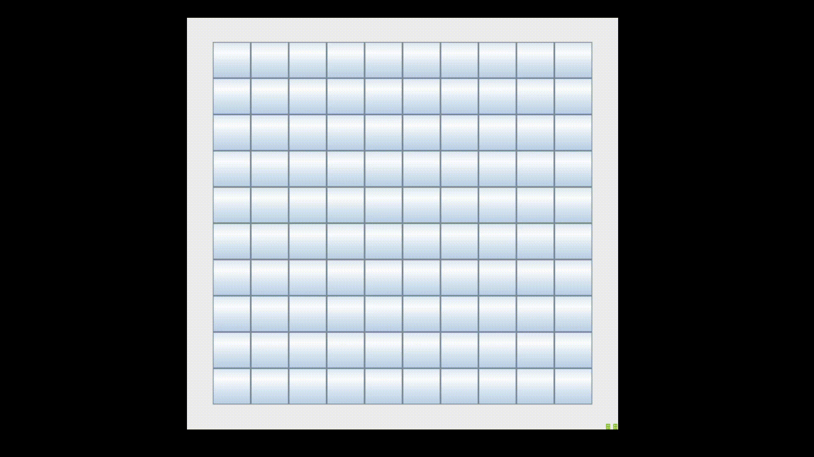

# Minesweeper

Created with Java Programming Language, programmed to function as Minesweeper. Designed with Java's Graphical User Interface.

User/Player will be notified if/when the player has lost or won and will be asked if he/she wants to play again. If the user does not was to play again, the game with close. If the player does want to play again, another minesweeper board will be created for the player to use and play on.
